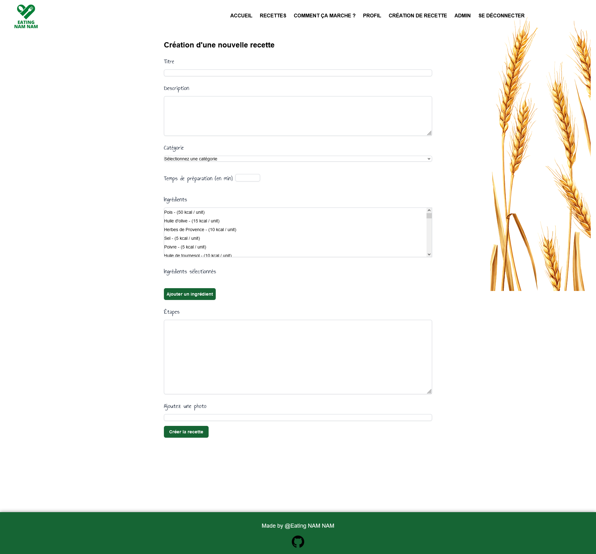

<p align="center">

</p>

## 🚀 Bienvenue sur notre projet 3 réalisé à la Wild Code School <br>

## 💡 Le concept

Une application qui permet de consulter et d'ajouter des nouvelles recettes.

## 🖥️ Aperçu version desktop :

<p align="center"> 

</p>

## 🛠️ Fonctionnalités:

### 👥 Partie Visiteur:

- L'utilisateur peut s'inscire ou se connecter.
- L'utilisateur peut consulter des recettes.
- L'utilisateur peut accéder aux pages instructions.

### 🔒 Partie Utilisateur connecté:

- L'utilisateur peut se déconnecter.
- L'utilisateur peut modifier son profil (mettre à jour ses informations).
- L'utilisateur peut ajouter/modifier une recette.

### 🛡️ Partie Administrateur:

- L'administrateur peut accéder au panel d'administration.
- L'administrateur peut accéder à la liste des utilisateurs.
- L'administrateur peut gérer les utilisateurs.

### 📝 Dans cette version:

- Créer un compte / Se connecter
- Il est possible d'ajouter une recette, et des ingredients.
- Possibilté de changer ses infos personnels
- Les pages sont fonctionnels
- la version desktop est fonctionnel

### 🔜 A venir:

- Ajouter des recettes en favoris, les rendre consultable sur la page profil.

## 🏗️ Structure de l'application

```mermaid
graph TD;
    Accueil;
    Accueil-->CGU;
    Accueil-->Recettes;
    Recettes-->Recette-Id;
    Recette-Id-->Modifier une recette;
    Accueil-->Créer une recette;
    Accueil-->Profil;
    Error404;
```

## 📈 Statut du projet

v1.1 en cours

## Technos utilisé


## 💻 Modélisation de la base de données

<p align="center"> 

</p>

## 🛠️ Setup & utilisation

### 📜 Commandes disponibles

- `npm i` : Initialisation du frontend et du backend, ainsi que de tous les outils
- `npm run db:migrate` : Exécute le script de migration de la base de données
- `npm run db:seed`: Injecte dans la base de données
- `npm run dev` : Démarre les deux serveurs (frontend + backend) dans un seul terminal
- `npm run dev:client` : Démarre le serveur frontend React
- `npm run dev:server` : Démarre le serveur backend Express
- `lint` : Exécute les outils de validation et refuse le code non conforme (sera exécuté à chaque _commit_)
- `fix` : Corrige les erreurs de linter (exécutez-le si `lint` grogne sur votre code !)

## 📄 Plus d'informations

- Le modèle utilisé pour ce projet est un modèle de fondation Fullstack réalisé par la Wild Code School.

- N'oubliez pas de créer vos fichiers .env pour le frontend et le backend en copiant les fichiers .env.sample de chaque répertoire.

### 🔧 Outils utilisé :

- _Concurrently_ : Permet de lancer plusieurs commandes simultanément dans la même interface de ligne de commande (CLI).
- _Husky_ : Permet d'exécuter des commandes spécifiques déclenchées par des événements git.
- _Vite_ : Alternative à Create-React-App, offrant moins d'outils pour une expérience plus fluide.
- _ESLint_ : Outil de "qualité du code", garantit que les règles choisies seront appliquées.
- _Prettier_ : Outil de "qualité du code" également, se concentre sur le guide de style.
- _Airbnb Standard_ : L'un des "standards" les plus connus, bien qu'il ne soit pas officiellement lié à ES/JS.
- _Nodemon_ : Permet de redémarrer le serveur à chaque mise à jour d'un fichier .js.

### 👥 Créateurs :

[Amel BONNEVIE](https://github.com/BonnevieAmel) - [Lauryn MARTIN](https://github.com/Lauryn333) - [Abdel-Djalil HAMZAOUI](https://github.com/AbdelDjalilH) - [Anthony CHAMPION RODRIGUES](https://github.com/AnthonyChampion) - [Quentin THUILLIER](https://github.com/BigLZN)
