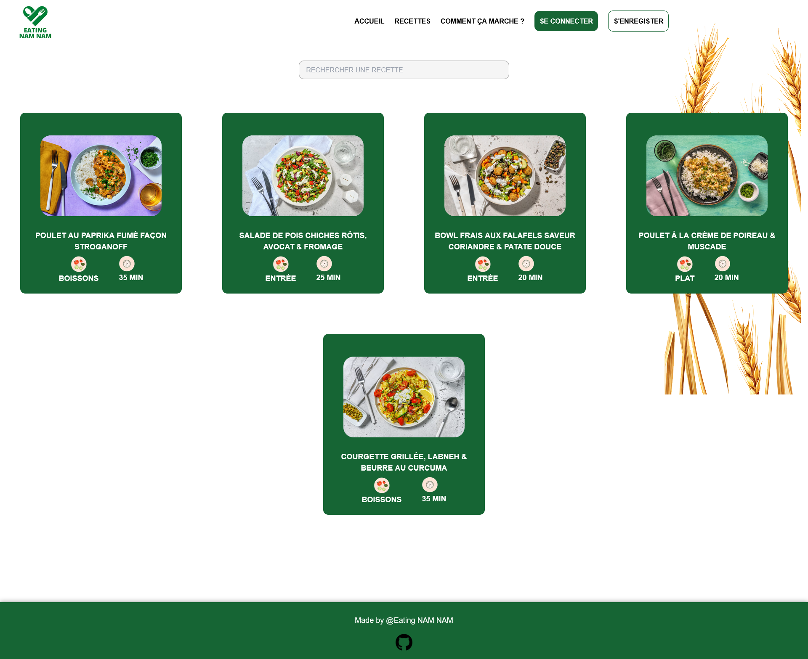
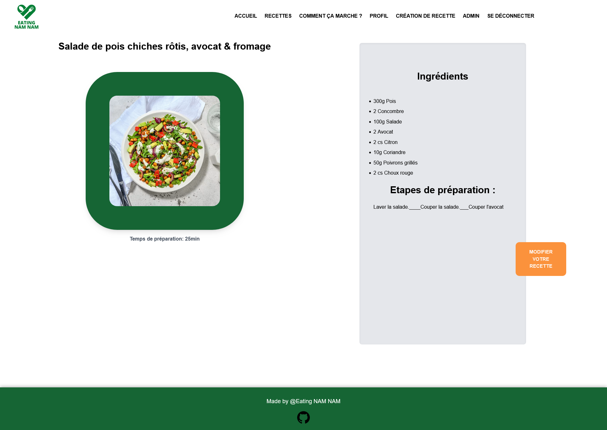

<p align="center">

</p>

## 🚀 Welcome on our third project achieved at the Wild Code School <br>

## 💡 Concept

A cooking web application which let the users to consult recipes and add new ones.

## 🖥️ Desktop overview :

<p align="center"> 

</p>

## 🛠️ Features:

### 👥 The visitor user:

- The user can register and log in.
- The user can look at recipies .
- L'utilisateur can access to the instructions pages.

### 🔒 The logged user:

- The user can log out.
- The user can update his profile (update his informations)
- The user can add or update a recipe.

### 🛡️ The admin user:

- The administrator can access to the admin panel.
- The administrator can access to the user's list.
- The administrator can manage the users.

### 📝 Current version:

- Create an account / Log in
- Possibility to add a recipe and ingredients.
- Possibility to update personnels informations
- The web pages are functional
- The desktop version is functional

### 🔜 A venir:

- Add new recipies in favorites, the user can access to them on his profile page.

## 🏗️ Structure de l'application

```mermaid
graph TD;
    Accueil;
    Accueil-->CGU;
    Accueil-->Recettes;
    Recettes-->Recette-Id;
    Recette-Id-->Modifier-une-recette;
    Accueil-->Créer-une-recette;
    Accueil-->Profil;
    Error404;
```

## 📈 Statut du projet

v1.1 en cours

## Technos utilisé


## 💻 Database modelization

<p align="center"> 

</p>

## 🛠️ Setup & use

### 📜 Available commands

- `npm i` : Initialisation of frontend and backend, as well as the other tool
- `npm run db:migrate` : Run the database migration script
- `npm run db:seed`: Seed the database
- `npm run dev` : Starts both servers (frontend + backend) in one terminal
- `npm run dev:client` : Starts the React frontend server
- `npm run dev:server` : Starts the Express backend server
- `lint` : Runs validation tools, and refuses unclean code (will be executed on every commit)
- `fix` : Fixes linter errors (run it if lint growls on your code !)

## 📄 Plus d'informations

- The model used for this project is a full-stack foundation model created by the Wild Code School.

- Remember to create your .env files for the frontend and backend by copying the .env.sample files from each directory.

### 🔧 Outils utilisé :

- _Concurrently_ : Allows for several commands to run concurrently in the same CLI.
- _Husky_ : Allows to execute specific commands that trigger on git events.
- _Vite_ : Alternative to Create-React-App, packaging less tools for a more fluid experience.
- _ESLint_ : Quality of code" tool, ensures chosen rules will be enforced.
- _Prettier_ : Quality of code" tool as well, focuses on the styleguide.
- _Airbnb Standard_ : One of the most known "standards", even though it's not officially linked to ES/JS.
- _Nodemon_ : Allows to restart the server everytime a .js file is udated.

### 👥 Créateurs :

[Amel BONNEVIE](https://github.com/BonnevieAmel) - [Lauryn MARTIN](https://github.com/Lauryn333) - [Abdel-Djalil HAMZAOUI](https://github.com/AbdelDjalilH) - [Anthony CHAMPION RODRIGUES](https://github.com/AnthonyChampion) - [Quentin THUILLIER](https://github.com/BigLZN)
